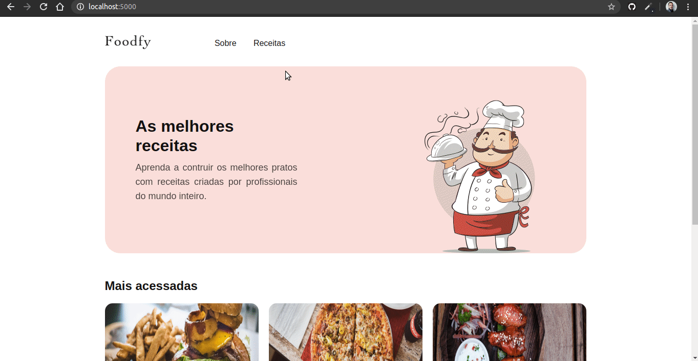

<h1 align="center">
    
</h1>

<h3 align="center">
  Desafios Foodfy
</h3>

  

  

---

## ℹ️ O é que o desafio Foodfy

É um desafio do LaunchBase Bootcamp 5 da Rocketseat onde a proposta é construir um site completo para uma empresa de receitas chamada Foodfy.

---

## 📑️ Etapas do desafio:

1. [Construindo Foodfy](https://github.com/jeanmontt/foodfy/tree/master/%23README-construindo-foodfy) ✔️
2. [Refatorando Foodfy](https://github.com/jeanmontt/foodfy/tree/master/%2302_README-refaturando-foodfy) ✔️
3. Admin Foody 🚧️
4. Persistindo dados do Foodfy 🚧️
5. Upload de imagens 🚧️
6. Apresentação e organização das receitas no Foodfy 🚧️
7. Sistema de Login Foodfy 🚧️
8. Conceitos avançados 🚧️

---

## 1️⃣️ Construindo Foodfy

<h1>

</h1>

Nesta etapa foi entregue o layout e assets para realizar a construção do front-end das páginas Home, Sobre, Receitas, além da construção do modal da página Receitas.

### 🚀️ Tecnologias utilizadas:

- HTML
- CSS
- JavaScript

---

## 2️⃣️ Refaturando Foodfy

<h1>

</h1>

Nesta estapa foi solicitado a criação de um banco de dados para as informações das receitas e utilizá-lo para as páginas "home" e "receitas".

Foi solicitado também que ao clicar em uma receita o usuário deve ser redirecionado para uma nova página contendo todas informações da receita como ingredientes, modo de preparo e informações adicionais.

Além disso. Dentro da página do detalhe da receita, em cada seção "Ingredientes", "Modo de preparo" e "Informações adicionais" criar um botão MOSTRAR ou ESCONDER que ao ser clicado deve mostrar ou esconder o texto abaixo do título baseado em seu estado de visibilidade.

### 🚀️ Tecnologias utilizadas:

- HTML
- CSS
- JavaScript
- NodeJS
- Express
- nunjucks
- nodemon

---

#### Desenvolvido com 💙️ por:

***Jean Monteiro*** 
  
